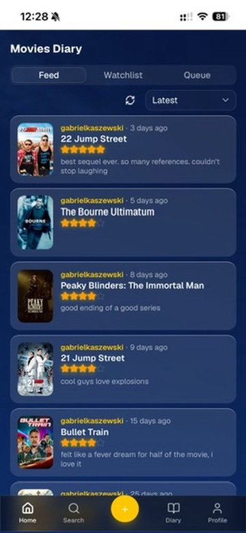
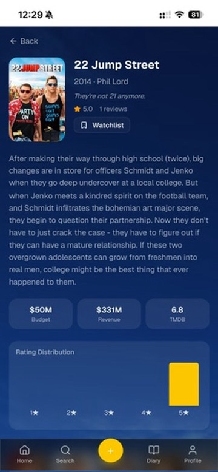
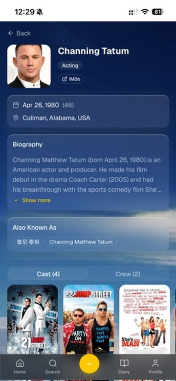
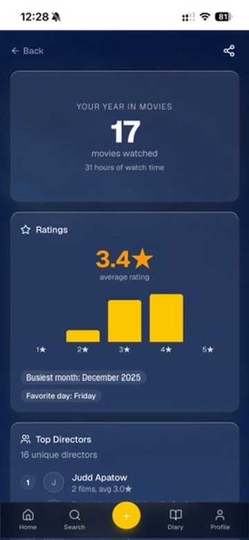
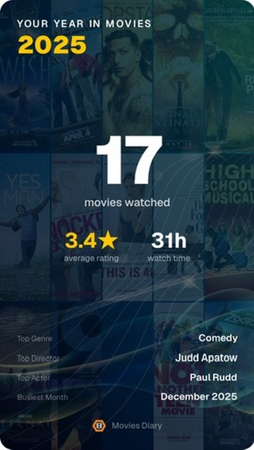

# Movies Diary

A self-hosted movie diary built in Rust. Ships a classic server-rendered HTML interface (no JavaScript) alongside a full React SPA, both backed by the same REST API. Federates over ActivityPub so reviews reach the Fediverse. Supports Jellyfin and Plex auto-import, full-text search, annual wrap-ups, goals, and bulk import from Letterboxd, IMDb, and other sources. Runs on SQLite or PostgreSQL.

[](LICENSE)
[](https://www.rust-lang.org/)
[](https://hub.docker.com/)
[](https://activitypub.rocks/)
[](https://www.sqlite.org/)

---

## Table of Contents

- [Quick Start](#quick-start)
- [Features](#features)
- [Screenshots](#screenshots)
- [Architecture](#architecture)
- [Prerequisites](#prerequisites)
- [Configuration](#configuration)
- [Run](#run)
- [API](#api)
- [SPA](#spa)
- [Development](#development)
- [Test](#test)
- [Docker](#docker)
- [Media Server Integration](#media-server-integration)
- [Annual Wrap-Up](#annual-wrap-up)
- [Contributing](#contributing)
- [License](#license)

---

## Quick Start

The fastest way to run Movies Diary is via Docker Compose:

```bash
cp .env.example .env
# Set JWT_SECRET and OMDB_API_KEY (or TMDB_API_KEY) in .env
docker compose up -d
```

Open `http://localhost:3000`. The HTTP server and background worker start together; data is persisted in a Docker volume.

---

## Features

- Log movies with a TMDB/OMDb ID or manual title/year/director, with a 1–5 rating and optional watch medium (cinema, streaming, TV, physical media, download, media server)
- Edit reviews after the fact — update rating, comment, date, or watch medium via partial PATCH; each watch is still a separate record (re-watches tracked)
- Background poster fetching and storage (local filesystem or S3-compatible)
- Movie enrichment via TMDb — full cast, crew, genres, keywords, runtime, budget/revenue, ratings; fetched automatically on movie discovery and refreshed every 30 days; exposed via `GET /api/v1/movies/{id}/profile`
- Full-text search across movies and people via `GET /api/v1/search` — free-text query plus structured filters (genre, year, person, department, language); backed by SQLite FTS5 or PostgreSQL tsvector + GIN indexes
- People as first-class entities — browse by person via `GET /api/v1/people/{id}` and full credit history via `GET /api/v1/people/{id}/credits`; index populated automatically during TMDb enrichment
- RSS/Atom feed for public subscription (global and per-user)
- JWT authentication via cookie (HTML) or Bearer token (REST API)
- ActivityPub federation — follow/unfollow remote users, accept/reject/remove followers, federated reviews broadcast as `Note` objects with movie poster image attachment, `#MoviesDiary` + `#MovieTitle` hashtags, paginated outbox (reviews, watchlist entries, goals), boost/Announce tracking, NodeInfo discovery endpoint, shared inbox delivery, actor profile sync (bio, avatar, discoverable); account migration via `Move` activity; account deletion broadcasts `Delete` actor to followers
- Federation moderation — instance-level domain blocking (admin-managed), per-user actor blocking with `Block` / `Undo Block` activities, delivery filter excludes blocked actors and blocked-domain inboxes
- Watchlist — add movies to watch later, per-user; federated watchlist entries visible for remote actors
- User profiles — display name, bio, avatar, banner, custom profile fields; editable via HTML settings page or REST API; account deletion broadcasts AP `Delete` actor activity; `alsoKnownAs` change triggers AP `Move` for account migration
- Jellyfin/Plex auto-import — media server sends a webhook on playback stop, movies land in a watch queue; review and confirm with a rating to create diary entries; per-user webhook tokens with SHA-256 auth; setup UI at `/settings/integrations`
- Annual Wrap-Up — Spotify Wrapped for movies: per-user and instance-wide year-in-review with stats (top directors, actors, genres, rating distribution, watch time, watch medium breakdown, rewatches, budget analysis); directors/actors filtered by minimum watch count for statistical relevance; shareable HTML page at `/wrapups/{user_id}/{year}`; admin-triggered or auto-generated in January
- Goals — set a "watch N movies in YEAR" target with a progress bar; progress computed from existing reviews (backwards compatible); per-user federation toggle in settings; displayed on profile (SPA: interactive with create/edit/delete, classic HTML: read-only glassmorphic card)
- Profile trends — top directors, genre breakdown, rating distribution histogram, watch medium breakdown, monthly activity chart; all computed from the user's review history
- CSV and JSON diary export
- File importer: upload CSV, TSV, JSON, or XLSX from any source (Letterboxd, IMDb, etc.), map columns to domain fields via a step-by-step wizard or REST API, save mapping profiles for repeat imports
- REST API v1 (`/api/v1/`) with full feature parity with the HTML interface
- OpenAPI documentation at `/docs` (Swagger UI) and `/scalar` (Scalar)
- CSRF protection on all HTML form routes (double-submit cookie, defense-in-depth on top of `SameSite=Strict`)
- Per-IP rate limiting via token bucket (production-grade, backed by `axum-governor`)
- Single-page app at `/app/` — React + TanStack Router + shadcn/ui, built with Vite, served from the backend with client-side routing fallback
- Terminal UI client (`crates/tui`, deprecated) for logging reviews, bulk CSV import, and diary browsing

## Screenshots

> SPA at `/app/` — React + TanStack Router + shadcn/ui

| Feed | Movie | Person |
|------|-------|--------|
|  |  |  |

| Profile | Wrap-Up | Wrap-Up card |
|---------|---------|--------------|
|  |  |  |

## Architecture

Hexagonal (Ports & Adapters) with Domain-Driven Design:

```
api-types           — shared REST API request/response DTOs (Serialize/Deserialize + utoipa schemas) + HtmlPageContext; used by presentation, tui, and template adapters
infra-wiring        — shared infrastructure types (DbPool, EventBusBackend, AppConfig) used by both presentation and worker binaries
domain              — pure types and CQRS port traits (MovieCommand/MovieQuery, WatchEventCommand/WatchEventQuery, GoalCommand/GoalQuery, DiaryQuery, PersonCommand/PersonQuery, SearchCommand/SearchPort, SocialCommand/SocialQuery, ImageFetcher, RssFeedRenderer), no external deps except serde
application         — use cases (commands + queries), business logic orchestration; handlers delegate here for all domain logic; modules: auth, diary, goals, import, integrations, movies, person, search, social, users, watchlist, wrapup
presentation        — Axum HTTP router, OpenAPI spec assembly, Swagger UI + Scalar serving, composition root for the HTTP process
worker              — standalone worker binary (event consumer, poster sync, federation)
adapters/
  adapter-common       — shared row-to-domain conversions, sqlx error mapping, date/uuid parsing utils
  auth                 — JWT issuance and validation (Argon2 passwords)
  sqlite               — SQLite repository + connection factory
  postgres             — PostgreSQL repository + connection factory
  metadata             — TMDB / OMDb HTTP client
  poster-fetcher       — downloads poster images
  object-storage       — stores images (posters + user avatars) on local filesystem or S3-compatible storage
  poster-sync          — event handler: triggers poster fetch+store on MovieDiscovered
  image-converter      — optional background worker: converts stored images to AVIF or WebP; backfills existing images via a 24h periodic job
  tmdb-enrichment      — TMDb HTTP client implementing MovieEnrichmentClient and PersonEnrichmentClient; event handlers (MovieEnrichmentHandler, PersonEnrichmentHandler) live in the application layer
  template-askama      — Askama HTML rendering
  rss                  — RSS/Atom feed generation
  export               — CSV and JSON diary serialization
  importer             — CSV/TSV/JSON/XLSX parser and column mapper for bulk import
  jellyfin             — Jellyfin webhook payload parser (MediaServerParser adapter)
  plex                 — Plex webhook payload parser (MediaServerParser adapter; requires Plex Pass)
  event-payload        — shared event serialization DTOs (used by all event bus adapters)
  sqlite-event-queue   — durable polling event queue backed by SQLite
  postgres-event-queue — durable polling event queue backed by PostgreSQL
  event-publisher      — in-memory event channel (used in tests)
  nats                 — NATS Core / JetStream event publisher and consumer
  event-publisher      — in-memory event channel (used in tests)
  activitypub          — ActivityPub federation adapter (follow, inbox/outbox, actor); delegates to k-ap for protocol internals
  sqlite-search        — SQLite FTS5 implementation of SearchPort + SearchCommand
  postgres-search      — PostgreSQL tsvector + GIN implementation of SearchPort + SearchCommand
  sqlite-federation    — SQLite-backed federation repository
  postgres-federation  — PostgreSQL-backed federation repository
tui                 — terminal UI client (ratatui); shares api-types with presentation for typed API access
spa/                — React SPA (TanStack Router + shadcn/ui + Vite); served at /app/ by the backend
```

## Prerequisites

- Rust (stable, 2024 edition)
- SQLite
- Poster storage: local filesystem (zero deps) or an S3-compatible object store (e.g. MinIO)
- An [OMDb API key](https://www.omdbapi.com/apikey.aspx)

## Configuration

Copy `.env.example` to `.env` and set the values below. Required fields must be set before the server will start.

| Variable | Default | Required | Description |
|---|---|---|---|
| `DATABASE_URL` | `sqlite://movies.db` | Yes | SQLite or PostgreSQL connection string |
| `JWT_SECRET` | — | Yes | Secret for JWT signing — use a long random string |
| `OMDB_API_KEY` | — | Yes | [OMDb](https://www.omdbapi.com/apikey.aspx) key for movie metadata |
| `TMDB_API_KEY` | — | No | [TMDb](https://www.themoviedb.org/settings/api) key — enables cast, crew, genres, enrichment |
| `BASE_URL` | — | Yes | Public URL of your instance (used for ActivityPub actor URLs) |
| `IMAGE_STORAGE_BACKEND` | `local` | No | `local` or `s3` |
| `IMAGE_STORAGE_PATH` | `./images` | No | Path for local image storage |
| `MINIO_ENDPOINT` | — | S3 only | S3-compatible endpoint (e.g. `http://localhost:9000`) |
| `MINIO_BUCKET` | — | S3 only | Bucket name |
| `MINIO_REGION` | — | S3 only | Region (e.g. `minio`) |
| `MINIO_ACCESS_KEY_ID` | — | S3 only | Access key ID |
| `MINIO_SECRET_ACCESS_KEY` | — | S3 only | Secret access key |
| `IMAGE_CONVERSION_ENABLED` | `false` | No | Convert stored images to AVIF or WebP |
| `IMAGE_CONVERSION_FORMAT` | `avif` | No | `avif` or `webp` |
| `HOST` | `0.0.0.0` | No | Bind address |
| `PORT` | `3000` | No | HTTP port |
| `RATE_LIMIT` | `60` | No | Requests per minute per IP |
| `ALLOW_REGISTRATION` | `true` | No | Set `false` to disable new sign-ups |
| `SECURE_COOKIES` | `true` | No | Must be `true` when serving over HTTPS |
| `RUST_LOG` | — | No | Log verbosity (e.g. `presentation=info,worker=info`) |
| `CORS_ORIGINS` | `*` | No | Comma-separated allowed origins for SPA dev |
| `EVENT_BUS_BACKEND` | `db` | No | `db` (default) or `nats` |
| `NATS_URL` | — | NATS only | NATS connection URL (e.g. `nats://localhost:4222`) |

The `worker` binary must run alongside `presentation` to process events:

```bash
cargo run -p worker
```

## Run

```bash
cargo run -p presentation   # HTTP server (0.0.0.0:3000)
cargo run -p worker         # event worker (poster sync, in a separate terminal)
```

The worker polls the event queue and must run alongside the presentation to process background tasks like poster fetching. Both processes share the same database.

## API

All REST endpoints are under `/api/v1/`. Authentication uses `Authorization: Bearer <token>` obtained from `POST /api/v1/auth/login`.

Interactive API documentation is available at runtime:

- **Swagger UI** — `http://localhost:3000/docs`
- **Scalar** — `http://localhost:3000/scalar`

An [Insomnia](https://insomnia.rest/) collection covering all endpoints is included at [`movies-diary.insomnia.json`](movies-diary.insomnia.json). Import it via **File → Import**, set `base_url` and `token` in the environment, and you're ready to go.

## SPA

The single-page app lives in `spa/` and is served at `/app/` by the backend. For local development:

```bash
cd spa && bun install && bun run dev   # http://localhost:5173/app/
```

Set `CORS_ORIGINS=http://localhost:5173` in the backend `.env` to allow cross-origin API calls during development.

For production, `bun run build` outputs to `spa/dist/` which the backend serves statically (included in Docker image automatically).

## Terminal UI (deprecated)

> **Note:** The TUI was an experiment with ratatui and is no longer actively maintained. It may not support newer features (goals, watchlist, federation, etc.). Contributions welcome — if you'd like to maintain it, open a PR.

```bash
cargo run -p tui
```

Supports review logging, bulk CSV import, and diary browsing.

## Development

A `Makefile` wraps the most common dev commands:

```bash
make           # default: fmt-check + clippy + test (same order as CI)
make fix       # auto-apply fmt + clippy fixes
make fmt       # apply rustfmt
make clippy    # clippy with -D warnings
make test      # cargo test
```

## Test

```bash
cargo test                    # full workspace (requires DATABASE_URL for sqlx offline checks)
cargo test -p application     # business logic tests only — no database required
cargo test -p domain          # domain model + value object tests
cargo llvm-cov -p application -p domain   # line coverage report (requires cargo-llvm-cov)
```

The `application` and `domain` crates have 400+ unit tests covering all use case modules (auth, diary, goals, import, integrations, movies, person, search, users, watchlist, wrapup) backed by in-memory fakes from `domain`'s `test-helpers` feature. These run without a database and are the fastest feedback loop for business logic changes.

## Docker

### Quick start

```bash
cp .env.example .env
# Edit .env — set JWT_SECRET and OMDB_API_KEY (or TMDB_API_KEY)
docker compose up -d
```

This builds and starts the HTTP server (port 3000) and event worker. Data is persisted in a Docker volume.

### Manual docker run

The image contains both `presentation` and `worker` binaries. Run them as separate containers sharing the same data volume:

```bash
docker build -t movies-diary .

docker run -p 3000:3000 --env-file .env -v movies-diary-data:/data movies-diary
docker run --env-file .env -v movies-diary-data:/data --entrypoint ./worker movies-diary
```

Build for PostgreSQL: `--build-arg FEATURES=postgres,postgres-federation`

## Media Server Integration

Auto-log movies you finish watching. Go to `/settings/integrations` to generate a webhook token, then configure your media server.

### Jellyfin

1. Install the **Webhook** plugin (Dashboard > Plugins > Catalog)
2. Add a **Generic** destination:
   - **URL**: `https://yourdomain.example.com/api/v1/webhooks/jellyfin`
   - **Header**: `Authorization` = `Bearer <your-token>`
   - **Send All Properties**: enabled
   - **Notification Type**: Playback Stop only
   - **Item Type**: Movies only

### Plex (requires Plex Pass)

1. Go to Settings > Webhooks in your Plex server
2. Add webhook URL: `https://yourdomain.example.com/api/v1/webhooks/plex`
3. Plex does not support custom headers natively — pass the token as a query param: `https://yourdomain.example.com/api/v1/webhooks/plex?token=<your-token>`

Movies you finish watching appear in your watch queue at `/watch-queue` — rate and confirm to add to your diary.

## Annual Wrap-Up

Generate a year-in-review summary for any user — top directors, actors, genres, rating distribution, total watch time, rewatch stats, and more. Available as a shareable HTML page.

**Generate via API** (admin only):
```bash
curl -X POST http://localhost:3000/api/v1/wrapups/generate \
  -H "Authorization: Bearer <admin-token>" \
  -H "Content-Type: application/json" \
  -d '{"user_id": "<uuid>", "start_date": "2025-01-01", "end_date": "2026-01-01"}'
```

Omit `user_id` for a global instance wrap-up. The worker computes stats in the background — poll `GET /api/v1/wrapups/{id}` for status.

**View:** `http://localhost:3000/wrapups/{user_id}/2025` (public, no login required)

**Auto-generate:** The worker runs a daily job in January that generates wrap-ups for all users with reviews in the previous year.

## Contributing

See [CONTRIBUTING.md](CONTRIBUTING.md) for setup instructions, architecture overview, and PR guidelines.

## License

MIT License. See [LICENSE](LICENSE).
